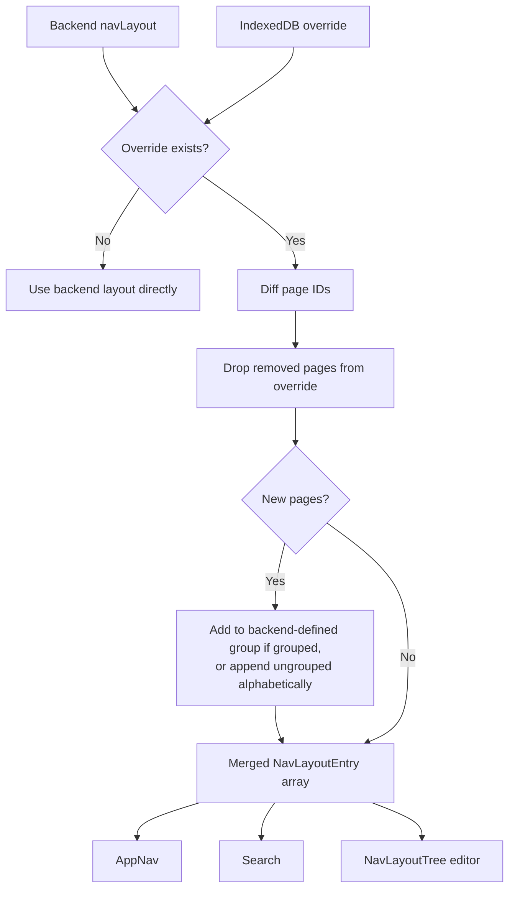
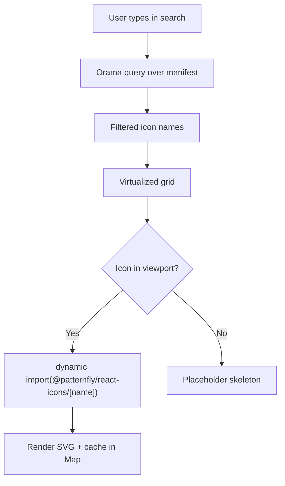
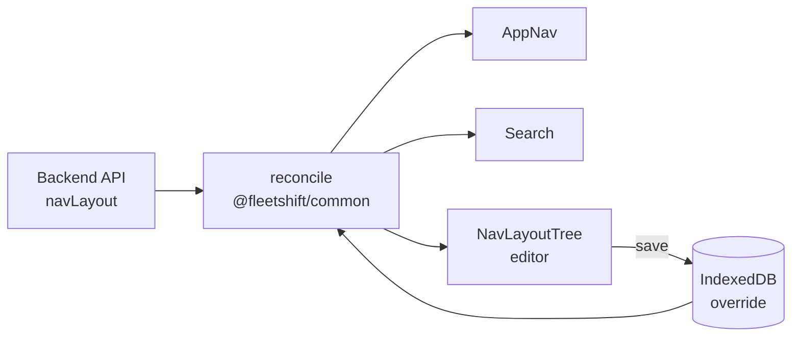

# Navigation Customization — User-Created Groups and Full Layout Editing

**Epic:** [OME-151 — Navigation Customization](https://redhat.atlassian.net/browse/OME-151)
**Spike:** [OME-146 — Spike: Navigation customization design](https://redhat.atlassian.net/browse/OME-146)
**Depends on:** [Module Groups](./module-groups.md) (implemented)
**Status:** Draft

**Phase stories:**
| Phase | Story | Summary |
|-------|-------|---------|
| 1 | [OME-152](https://redhat.atlassian.net/browse/OME-152) | Storage and merge — NavLayoutOverride + reconciliation |
| 2 | [OME-153](https://redhat.atlassian.net/browse/OME-153) | Tree editor — wire NavLayoutTree into settings |
| 3 | [OME-154](https://redhat.atlassian.net/browse/OME-154) | Custom group CRUD — create, edit, delete |
| 4 | [OME-155](https://redhat.atlassian.net/browse/OME-155) | PF Icon Gallery — manifest, Orama, virtualized grid |
| 5 | [OME-156](https://redhat.atlassian.net/browse/OME-156) | "More" hidden items — ghost list, collapsed NavExpandable |
| 6 | [OME-157](https://redhat.atlassian.net/browse/OME-157) | Search + AppNav updates — merged layout in search |

## Context

Module groups (OME-149/150) introduced plugin-defined expandable nav sections. The settings page can reorder groups and pages at the top level via `NavOrderEditor`, which uses PF `DragDropSort` on a flat list.

Users need richer customization:

- **Create custom groups** — user-defined buckets not backed by any plugin manifest, with a name and an icon from PF's icon set.
- **Move modules between groups** — drag a module out of a plugin-defined group into a custom group, or ungroup it.
- **Reorder within groups** — rearrange modules inside a group, not just top-level entries.
- **Delete/rename custom groups** — edit or remove groups the user created.

These are cosmetic changes — they affect sidebar rendering and search grouping but **do not change URLs or routes**. A module dragged from "Settings" into "My Tools" still resolves at `/settings/navigation`.

- **Hide nav items** — remove items from the main nav into a collapsed "More" section at the bottom (Gmail-style). Items are still accessible — just tucked away. Users can restore them by dragging back out.

## Current State

### NavOrderEditor (settings-plugin)

`NavOrderEditor.tsx` — flat DragDropSort over two lists (Main / Bottom). Calls `useNavPages()` to get entries, `useNavOrder()` to persist a flat `string[]` to IndexedDB. Groups appear as atomic items — no nesting UI.

### NavLayoutTree (gui — built but not wired in)

`components/NavLayoutTree/` — full dnd-kit tree with:
- `flattenLayout()` / `buildLayout()` — round-trip between `NavLayoutEntry[]` and `FlatNode[]`
- `getProjection()` — horizontal offset → depth projection for drag-into-group
- `TreeItem` / `TreeItemOverlay` — draggable rows with grip handle, edit/delete buttons for sections
- Already supports group, section, and page node kinds
- Edit and delete buttons exist for sections but not for groups

### IndexedDB Storage

`extensionInstall.ts` — `nav-order` object store holds a single key `"order"` → `string[]`. No support for storing layout structure (group definitions, children assignments).

## Design

### Storage: Same shape as backend `navLayout`

The override stores the same `NavLayoutEntry[]` the backend returns — including custom groups. This means the shell's consumers (AppNav, search, NavLayoutTree) don't need a translation layer. The `NavLayoutTree` already round-trips through this shape via `flattenLayout()` / `buildLayout()`.

```typescript
// IndexedDB shape
interface NavLayoutOverride {
  version: 1;
  layout: NavLayoutEntry[];  // Same shape as backend navLayout, plus user-* groups and "more" bucket
}

// NavLayoutEntry type discriminated union
type NavLayoutEntry =
  | { type: "page"; pageId: string; iconOverride?: string }
  | { type: "group"; groupId: string; pluginKey?: string; label: string; description?: string; keywords?: string[]; children: NavLayoutEntry[]; icon?: string; iconOverride?: string }
  | { type: "more"; children: NavLayoutEntry[] };  // hidden items — max one, always last
```

The only thing **not** stored in the override is routing. `pluginPages` always comes from the backend — URLs are owned by plugin manifests, not the user's nav layout.

**Backward compat:** If IndexedDB contains only a flat `string[]` (current format), treat it as ordering-only — apply `orderByIds()` to the backend layout, no custom groups. The new `NavLayoutOverride` shape takes over on first save from the new editor.

### Reconciliation: backend + override

The reconciliation is a set diff on page IDs. Collect all page IDs from backend → `backendIds`. Collect all page IDs from override → `overrideIds`. Two sets:

- **Added:** `backendIds - overrideIds` — new plugins since last edit.
- **Removed:** `overrideIds - backendIds` — uninstalled plugins.

Everything else keeps the user's arrangement.



**Rules:**

1. **No override:** Use backend layout directly.
2. **Added pages:** If the backend places the new page in a group, insert it into that group in the override. If ungrouped, append to end alphabetically.
3. **Removed pages:** Drop silently from override — no tombstones.
4. **Plugin-defined groups:** Persist in the override even if the user moved all children out. Empty groups are hidden in the nav (AppNav filters them out) but remain visible in the editor so users can drag modules back in.
5. **Custom groups (`user-*`):** Same behavior — empty ones are hidden in nav, visible in editor. Users can also delete them entirely via the editor.
6. **Hidden items (More bucket):** Pages inside the `"more"` entry are still tracked by ID. During reconciliation, removed pages are dropped from More just like anywhere else. Added pages go into the main section, never into More — users explicitly choose what to hide.

### NavLayoutEditor — replaces NavOrderEditor

Replace the flat `DragDropSort` with the existing `NavLayoutTree` components. The tree editor already supports:

- Drag pages between depth 0 (top-level) and depth 1 (inside group)
- Group and section node kinds with proper projection
- Grip handles, edit/delete actions

**What's needed:**

| Capability | Current NavLayoutTree | Needed |
|---|---|---|
| Reorder top-level items | Yes | Yes |
| Drag page into group | Yes (depth projection) | Yes |
| Drag page out of group | Yes (depth projection) | Yes |
| Create custom group | No | **New** — "Add group" button + modal |
| Rename custom group | No (sections only) | **New** — edit button on custom groups |
| Delete custom group | No (sections only) | **New** — delete button, children ungroup |
| Assign icon to custom group | No | **New** — icon picker in create/edit modal |
| Main/Bottom split | No | **New** — divider or two-list layout |
| Reset single item | No | **New** — revert one module to its backend position/group |
| Reset all | No | **New** — clear entire IndexedDB override (confirmation dialog) |

### Custom Group CRUD

**Create:** "Add group" button at the bottom of the tree. Opens a modal:
- Text input: group name (required)
- Text input: description (required) — used in search results, improves discoverability
- Text input: keywords (optional) — comma-separated, boost search matching
- Icon picker: PF icon gallery (see below)
- Creates a new `NavLayoutGroup` entry with `id: "user-${slugify(name)}"`, empty children
- Inserted at the end of the main section

**Edit:** Pencil icon on custom groups (not plugin-defined groups — those are read-only). Opens same modal pre-filled.

**Delete:** Trash icon on custom groups. Children are ungrouped — moved to top level at the position where the group was. Confirmation prompt.

**Constraint:** Plugin-defined groups (from manifests) cannot be renamed, deleted, or have their icon changed. They can only be reordered and have modules moved in/out. Visually: plugin groups show no edit/delete buttons, only a grip handle.

### PF Icon Gallery

Custom groups and icon overrides need a picker. PF ships ~1000 icons in `@patternfly/react-icons`.

#### Build-time manifest

Generate a JSON manifest of available icons:

```json
[
  { "name": "CogIcon", "keywords": ["settings", "gear", "configuration"] },
  { "name": "UserIcon", "keywords": ["person", "account", "profile"] }
]
```

Script reads `@patternfly/react-icons` package exports and writes `pf-icons.json`. Run as part of `npm run build:all` or as a standalone `npm run generate:icons`. The manifest is small (~30KB — names and keywords, no SVG data).

#### Search with Orama

The icon gallery uses Orama (already in the project for global search) to index the manifest. This gives fuzzy matching, typo tolerance, and stemming out of the box — searching "setings" still finds `CogIcon`. The Orama index is built once when the gallery modal opens and destroyed on close.

#### Virtualized grid with IntersectionObserver

The gallery renders a fixed-width grid (constrained max-width to avoid showing too many icons on wide screens). Icons are loaded on demand via `IntersectionObserver` — only icons scrolling into the viewport trigger a dynamic `import()`.



**Details:**

- **Grid layout:** Fixed column count (e.g., 6-8 columns), constrained `max-width` (~400px). Keeps the gallery focused even on ultra-wide screens.
- **IntersectionObserver:** Attached to each grid cell. When a cell enters the viewport, fire `import()` for that icon. Once loaded, cache the component in a `Map<string, ComponentType>` — subsequent renders are instant.
- **No pagination, no chunks.** Smooth scroll, load on visibility. Searching narrows the list so most queries show <50 results anyway.
- **Empty state:** When Orama returns no results, show "No icons match" with the query highlighted.
- **Selection:** Click an icon to select it. A preview row at the top shows the selected icon at nav size alongside the name. Confirm/cancel buttons.

#### Runtime icon loading (nav + search)

Selected icons are stored by name string (e.g., `"CogIcon"`). At render time:

1. Dynamic `import()` for the icon by name.
2. Cache in a module-level `Map` shared across AppNav and search.
3. Show a small skeleton placeholder while loading (first render only — cached after that).

### Icon Customization

Users can override icons on **any** nav item — custom groups, plugin-defined groups, and individual modules.

The override stores both the original and the user's choice. At render time, the override takes priority:

```typescript
// Extended NavLayoutPage in override
interface NavLayoutPageOverride extends NavLayoutPage {
  iconOverride?: string;  // PF icon name, e.g. "RocketIcon"
}

// Extended NavLayoutGroup in override
interface NavLayoutGroupOverride extends NavLayoutGroup {
  icon?: string;          // PF icon name for custom groups (required on create)
  iconOverride?: string;  // PF icon name override for plugin-defined groups
}
```

**Render priority:** `iconOverride ?? plugin-defined icon (from resolved extensions)`

**Important:** PF `NavExpandable` does not support icons — groups are always label-only in the sidebar nav. Group icons are only used in the **editor** (to visually identify groups in the tree) and in **search results** (where groups appear as category headers).

This means:
- **Modules in nav:** Plugin provides the icon via CodeRef. If the user sets `iconOverride`, that wins. Rendered via `<Icon>` inside the `NavItem` link.
- **Modules in search:** Same override priority.
- **Custom groups in nav:** Label-only (`NavExpandable` title is plain text).
- **Custom groups in editor/search:** User-selected icon displayed.
- **Plugin-defined groups:** Label-only everywhere in nav. In editor/search, no icon unless user sets `iconOverride`.

The icon gallery (PF icon picker) is used for both custom group creation and icon overrides on any item. The editor shows a small icon button on each row — click to open the gallery.

### "More" Bucket — Gmail-Style Hidden Nav

Users can hide nav items they don't use regularly. Hidden items move into a collapsed "More" section at the bottom of the nav — always present, collapsed by default, expandable on click. Nothing is truly removed — just tucked away.

```
▾ Settings
    Navigation
    Authentication
  Overview
  Clusters
  ─────────────────
  ▸ More                  ← collapsed by default
      Extensions          ← hidden by user, still clickable
      Day One             ← hidden by user, still clickable
```

**Behavior:**

- **Nav rendering:** More renders as a `NavExpandable` with a fixed id (`_more`). Collapsed by default. Expands when clicked. Items inside are fully functional — clicking navigates normally.
- **Auto-expand:** If the user navigates to a hidden page (via URL, search, or bookmark), the More section auto-expands and the item highlights as active.
- **Search:** Hidden items still appear in search results. They're not invisible — just deprioritized in the nav.
- **Groups in More:** An entire group can be hidden (moves the group + all children into More). Individual children of a group can also be hidden — they move to More as ungrouped items, while the group stays in the main nav with remaining children.

**Editor interaction — ghost list, not hide buttons:**

The editor renders **two DnD lists** separated by a visual divider:

1. **Active nav** — the main tree (groups, pages, ordering). Drag items here to reorder.
2. **Hidden items** — a flat list below a "Hidden" label. Items appear as **ghosts** (dimmed, muted text, dashed border) to make it obvious they're tucked away.

Hiding: drag an item from the active tree down into the hidden list. Restoring: drag a ghost from the hidden list back into the active tree at the desired position. Both directions use the same dnd-kit drag — no separate "hide" or "unhide" buttons needed. This keeps the interaction model consistent: everything is drag-and-drop.

```
┌──────────────────────────┐
│  ☰ Overview              │
│  ☰ Clusters              │
│  ▾ Settings              │
│      ☰ Navigation        │
│      ☰ Authentication    │
│ ─── Hidden ───────────── │
│  ┊ Extensions       ┊    │  ← ghost (dimmed, dashed)
│  ┊ Day One          ┊    │  ← ghost
└──────────────────────────┘
```

**Storage:** The More section is a special entry in the override layout:

```typescript
// In NavLayoutEntry[]
{
  type: "more",
  children: [
    { type: "page", pageId: "settings.extensions" },
    { type: "page", pageId: "day-one.welcome" }
  ]
}
```

`NavLayoutEntry` gains a `"more"` type variant. There's exactly one More entry per layout, always last. If it doesn't exist in the override, there's no More section (all items visible — default).

### URL Behavior

Custom groups are **cosmetic only** — they do not own a URL namespace:

- A module at `/settings/navigation` stays at `/settings/navigation` even when dragged into a custom group "My Tools".
- Custom groups have no redirect URL (unlike plugin groups which redirect `/{groupId}` → first child). Clicking a custom group only expands/collapses it.
- Search results link to the module's real URL, not a custom group URL.

This means the `ConsoleRoutes` redirect logic only applies to plugin-defined groups. Custom groups don't need route entries.

### Search Integration

When a user moves modules into custom groups, search should reflect the customized hierarchy:

- Custom groups appear as `nav-group` category entries in search
- Modules moved into custom groups show the custom group as their parent
- The search index rebuilds when the nav layout override changes

### Data Flow



The reconciliation logic lives in `@fleetshift/common` so both AppNav and search consume the same merged layout.

## Implementation Phases

### Phase 1: Storage and Merge

1. New IndexedDB store shape: `NavLayoutOverride` with full `NavLayoutEntry[]`.
2. `mergeLayout(backend, override)` function in `@fleetshift/common`.
3. Migrate `useNavOrder` → `useNavLayout` (or extend it) to read/write the new shape.
4. `AppNav` consumes merged layout instead of `orderByIds()`.
5. Backward compat: if only a flat `string[]` exists in IndexedDB, treat it as ordering-only (no custom groups).

### Phase 2: Tree Editor

1. Wire `NavLayoutTree` into the settings plugin as the new NavLayoutEditor.
2. Replace PF `DragDropSort` with dnd-kit tree (already built).
3. Add main/bottom divider support.
4. Add "Reset to default" (clear override from IndexedDB).
5. Persist `buildLayout(nodes)` to IndexedDB on every drop.

### Phase 3: Custom Group CRUD

1. "Add group" button → modal with name input.
2. Edit/delete buttons on custom groups in tree editor.
3. Custom group entries in merged layout with `id: "user-*"` prefix.

### Phase 4: PF Icon Gallery

1. Build-time script: generate `pf-icons.json` from `@patternfly/react-icons`.
2. Icon picker modal with search/filter and grid layout.
3. Dynamic `import()` for rendering selected icon at runtime.
4. Store icon name in custom group definition.

### Phase 5: "More" Hidden Items

1. `NavLayoutEntry` gains `"more"` type variant.
2. `mergeLayout()` reconciles hidden items (drop removed, never auto-hide added).
3. Editor: second DnD list below divider — ghost items with dimmed/dashed styling.
4. `AppNav` renders `NavExpandable` for More section at bottom, collapsed by default.
5. Auto-expand More when active route matches a hidden page.

### Phase 6: Search + AppNav Updates

1. `SearchProvider` respects merged layout for group hierarchy.
2. `AppNav` renders custom group icons via dynamic import.
3. Custom groups in search results.
4. Hidden items still searchable — search index includes More children.

## Decisions

- **Same shape as backend.** Override stores `NavLayoutEntry[]` — same structure the backend returns. No translation layer. AppNav, search, and the tree editor all consume it directly.
- **Cosmetic only.** Custom groups don't change URLs. Routes are owned by plugin manifests, not user layout.
- **Plugin groups can't be renamed or deleted.** Users can reorder them, move modules in/out, and override their icon — but the group itself is owned by the plugin manifest.
- **Empty groups hidden in nav, visible in editor.** AppNav filters out groups with no children. The editor shows them so users can repopulate.
- **Icon overrides on anything.** Users can override icons on modules, plugin groups, and custom groups. Override stored alongside original; override wins at render time.
- **`user-` prefix** for custom group IDs — distinguishes user-created from plugin-defined at reconciliation time.
- **Icon by name.** Store PF icon name string, load via dynamic import. No custom SVG upload (for now).
- **Backward compat.** Existing flat `string[]` in IndexedDB is honored as ordering-only until the user saves from the new editor.
- **Gmail-style More bucket.** Hidden items live in a collapsed `NavExpandable` at bottom of nav. Auto-expands on active route match. Editor uses a ghost list (dimmed, dashed) — hide/restore by dragging between active tree and hidden list, no separate buttons.
- **Two reset levels.** Per-item (reverts module to backend-defined position) and full (clears entire override). Both with confirmation dialogs.
- **Custom groups require description.** Keywords optional. Both feed into Orama search index.
- **Single layout in IndexedDB.** No RBAC, no shared backend storage yet. Future: RBAC-scoped layouts.
- **Main/Bottom split frozen.** Controlled by `CORE_EXTENSION_META`. No cross-section drag — pending UX review.

## Resolved Questions

- [x] **Custom group search metadata:** Description required, keywords optional. Feeds into Orama index for better search matching.
- [x] **Max custom groups:** Uncapped for now.
- [x] **Reset:** Two levels — per-item reset (reverts one module to backend position/group) and full reset (clears entire override). Both behind confirmation dialogs since they're destructive.
- [x] **Main/Bottom drag:** Keep the split as-is (`CORE_EXTENSION_META`), no cross-section drag yet. Pending UX discussion — groups may make the main/bottom distinction less meaningful long-term.
- [x] **Multiple layouts / RBAC:** Single layout per user in IndexedDB for now. No shared backend storage yet. Future: RBAC-scoped layouts when backend storage lands.

## Open Questions

- [ ] UX discussion: does the main/bottom split still make sense with groups? May consolidate into a single section.

## Related

- [Module Groups design](./module-groups.md) — plugin-defined groups (implemented)
- [OME-123](https://redhat.atlassian.net/browse/OME-123) — Settings plugin with DnD navigation ordering (closed, current flat implementation)
- [Feature Contracts](./feature-contracts.md) — extension model fundamentals
